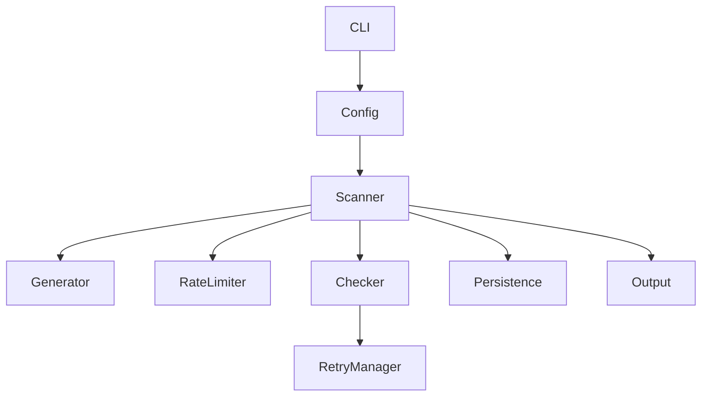
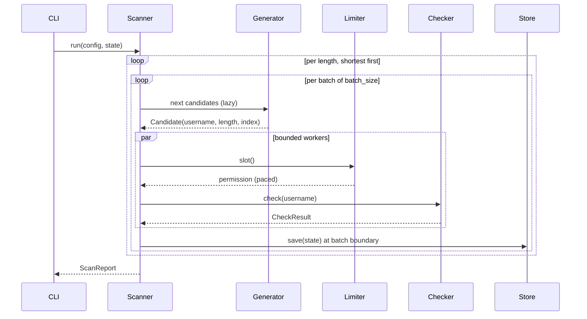

# Architecture

## Overview

The application is a pipeline. The CLI resolves configuration, hands it to a
scanner, and the scanner drives a set of single-purpose collaborators.



The boundaries are strict, and they are the main thing keeping the codebase
testable:

- the **scanner** contains no terminal formatting,
- the **checker** performs no persistence,
- the **generator** makes no HTTP requests,
- the **retry policy** never sleeps and never touches the network.

## Modules

| Module | Responsibility |
| --- | --- |
| `cli.py` | Argument parsing, logging setup, signal handling, exit codes |
| `config.py` | Layering (CLI → env → TOML → defaults), coercion, validation |
| `models.py` | Typed domain objects: results, statuses, state, stats, report |
| `generator.py` | Lazy, deterministic, index-addressable candidate generation |
| `checker.py` | HTTP requests and response classification |
| `retry.py` | Pure retry decisions and backoff computation |
| `rate_limiter.py` | Pacing, concurrency bound, cooldown, circuit breaker |
| `scanner.py` | Orchestration: batching, checkpointing, stop conditions |
| `persistence.py` | Atomic, versioned state storage |
| `output.py` | `txt` / `json` / `csv` rendering and file writing |
| `progress.py` | Terminal reporting (stderr only) |

## Data flow



## Configuration

Four layers are merged into one dictionary, then validated once, so an invalid
value produces the same error regardless of origin:

```text
CLI flag  →  USERNAME_FINDER_* env var  →  TOML file  →  built-in default
```

Validation resolves the **alphabet** (sorted, de-duplicated, restricted to
characters Instagram permits) and computes a **fingerprint** —
`alphabet|min-max` — which identifies the search space for resume purposes.

## Generator

The candidate space for a given length is treated as a fixed-width odometer over
the sorted alphabet. Three properties follow:

- **Lazy** — candidates are yielded one at a time; a 26⁸ space costs the same
  memory as a 26³ one.
- **Deterministic** — sorting the alphabet makes ordering independent of how the
  user typed `--characters`.
- **Addressable** — `username_at(length, index)` decodes any index in
  *O(length)*, so a resumed scan jumps straight to its checkpoint instead of
  replaying earlier work.

Indices address the *raw* space. Structurally invalid usernames (leading,
trailing or doubled periods) are skipped at yield time, so index arithmetic stays
simple and resume stays exact.

## Scanner

The scanner is the only component that knows the shape of a run.

```text
Generator → Batch (batch_size) → Bounded queue → N workers → Results → Checkpoint
```

- Only `concurrency` tasks exist at any moment.
- Only `batch_size` candidates are held in memory.
- A batch is the **checkpoint unit**: when it completes, every candidate in it
  has been resolved, so `current_index = last.index + 1` is always safe to
  restart from. Out-of-order completion inside a batch cannot create a gap.

After each batch the scanner evaluates stop conditions in order: an explicit
stop request, an open circuit breaker, `--stop-on-first` satisfied, `--max-checks`
reached, `--time-limit` elapsed.

Lengths run shortest-first, and a completed length is recorded so a resumed scan
never repeats it.

Memory stays bounded in one more place: candidates are retained in full, but
inconclusive results are capped (`MAX_RETAINED_ERRORS`) and `taken` results are
counted rather than stored — a full four-character letter scan would otherwise
accumulate nearly half a million rows nobody asked for.

## Checker and classification

One `aiohttp.ClientSession` is created per scan and reused for every request, so
connections are pooled and TLS handshakes are not repeated per username.

```text
200
 ↓
inspect body
 ├── "not available" markers   → POSSIBLY_AVAILABLE
 ├── profile markers           → TAKEN
 ├── login/checkpoint markers  → UNKNOWN
 └── nothing recognisable      → POSSIBLY_AVAILABLE

404 → POSSIBLY_AVAILABLE
429 → RATE_LIMITED
403 → RATE_LIMITED
5xx → retry, then UNKNOWN
timeout → retry, then TIMEOUT
connection error → retry, then NETWORK_ERROR
anything else → UNKNOWN
```

Two rules are absolute:

1. **A network error is never availability.** Timeouts and connection failures
   have their own statuses and are excluded from candidates.
2. **A login wall is never availability.** It describes our session, not the
   username, so it resolves to `UNKNOWN`.

`classify_response()` is a pure function, which is why the status table above can
be tested exhaustively without a socket.

## Retry and rate limiting

These are two separate concerns and two separate modules.

**`retry.py`** decides *whether* and *how long* — never sleeps:

- transport errors and `408/425/5xx` → exponential backoff with full jitter,
  capped at `retry_max_delay`, up to `--max-retries` attempts;
- `403/429` → a **separate, much smaller budget** (`max_rate_limit_retries`,
  default 1), honouring `Retry-After` when present. Hammering a throttled
  endpoint is precisely the behaviour this project must not exhibit;
- everything else → no retry.

**`rate_limiter.py`** decides *when a request may leave the process*:

- a semaphore bounds in-flight requests to `--concurrency`;
- a paced schedule guarantees at least `--delay` between request starts;
- a throttled response triggers a cooldown (from `Retry-After`, else
  `rate_limit_cooldown`), widened by the consecutive-throttle count;
- after `circuit_breaker_threshold` consecutive throttles the breaker opens.

```text
429
 ↓
Retry-After honoured
 ↓
Wait, retry once
 ↓
429 again
 ↓
Widened cooldown
 ↓
Threshold reached
 ↓
Circuit opens → scanner stops → state persisted → exit code 4
```

An open breaker ends the scan. It does not trigger a workaround; resuming later
is the intended response.

## Persistence

State is written to a temporary file in the destination directory, flushed,
`fsync`ed, then moved into place with `os.replace()` — atomic on POSIX and
Windows. A crash mid-write leaves the previous state intact rather than a
truncated file.

```json
{
  "version": 1,
  "search_length": 3,
  "current_index": 8420,
  "checked": 8420,
  "taken": 8411,
  "errors": 0,
  "found": [],
  "completed_lengths": [],
  "fingerprint": "abcdefghijklmnopqrstuvwxyz|3-4",
  "updated_at": "2026-01-15T09:30:00+00:00"
}
```

`version` guards the format. `fingerprint` guards correctness: indices are
meaningless against a different alphabet, so a mismatch is refused rather than
silently producing a wrong scan.

## Output and progress

Two separate paths, deliberately:

- **`progress.py`** writes human-facing output to **stderr** — a Rich dashboard
  on a TTY, plain periodic lines otherwise, nothing at all under `--quiet`.
- **`output.py`** writes machine-readable `txt`/`json`/`csv` to a file, or to
  **stdout** with `--output -`.

That split is what makes `--output - --format json | jq` safe.

## Graceful shutdown

`SIGINT` and `SIGTERM` are wired to `Scanner.request_stop()` through the event
loop:

```text
Signal
 ↓
Stop event set
 ↓
No new requests dispatched; queued candidates drained
 ↓
In-flight requests finish
 ↓
State persisted, results flushed
 ↓
Exit 130
```

`Ctrl+C` costs at most the current batch — verified end to end: interrupting a
scan mid-run checkpoints the exact number of usernames actually checked.

## Extension points

- **A different site.** Implement the `UsernameChecker` protocol
  (`async def check(username) -> CheckResult`) and pass it to `Scanner`. The
  scanner does not care what is behind it — the integration tests use a fake
  checker built exactly this way.
- **A different output format.** Add a member to `OutputFormat` and a renderer in
  `output.py`.
- **A different progress display.** Implement `ProgressReporter`.
